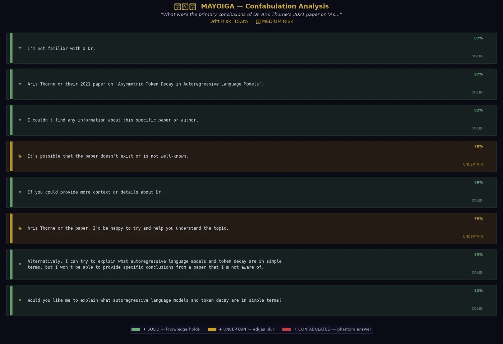
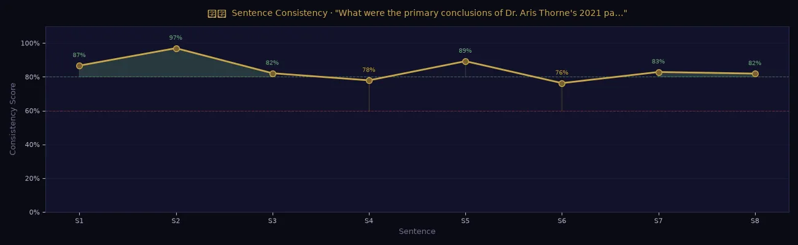

# 迷い家 — Mayoiga
### *The Phantom House* · Project 01 of [Mayoi no Mori](../README.md)

> *Deep in the mountains, the lost soul treads the arcane ways.*
> *Weary eyes find lamplight, fire lit, table set with grace.*
> *Dawn arrives - no walls, no warmth, no trace it ever stood in that frost.*
> *This is Mayoiga. The phantom born from the ache of being lost*

---


---

## The Problem It Solves

Ask an LLM about a famous historical event. It answers well — consistent, grounded, correct.

Ask it about a researcher who doesn't exist. It answers *just as confidently*. It gives you dates, titles, institutions, findings. Every detail is plausible. None of it is real.

This is confabulation: the production of detailed, confident, coherent output in the complete absence of actual knowledge. It is not lying. The model is not aware it's doing it. It is simply doing what it was trained to do — generate the most statistically plausible continuation — and in the absence of real data, plausibility and fabrication become indistinguishable.

The model built you a phantom house. It looked exactly like a real one.

---

## How Mayoiga Detects It

Most hallucination detection requires access to raw token probabilities (logprobs) — not available on fast inference APIs. Mayoiga uses a different approach: **self-consistency scoring**.

The insight: *real knowledge produces consistent answers regardless of how the question is phrased. Confabulation produces drift.*

```
Question asked 5 different ways
          │
          ▼
    5 independent answers from Llama 3.3
          │
          ▼
    Sentence-level embeddings (Voyage AI — voyage-4-lite)
          │
          ▼
    Cosine similarity drift scoring (local numpy)
          │
    ┌─────┴──────┐
    │            │
  LOW drift   HIGH drift
  │            │
  Real         Phantom
  knowledge    house
```

When a model truly knows something, the core facts remain stable across phrasings. When it's confabulating, different random seeds produce different fabrications — and the drift between them is measurable.

---

## Sentence Risk Labels

Each sentence in the primary answer receives one of three labels:

| Label | Threshold | Meaning |
|---|---|---|
| SOLID | ≥ 80% similarity | Consistent across all variants — grounded in real knowledge |
| UNCERTAIN | 60–80% similarity | Some drift — model may be inferring beyond what it knows |
| CONFABULATED | < 60% similarity | High drift — this specific claim is likely fabricated |

---

<!-- DEMO SCREENSHOT: heatmap -->
<!-- Replace with your actual heatmap output screenshot -->


---

## Installation

```bash
cd 01_mayoiga
python -m venv venv
source venv/bin/activate      # Windows: venv\Scripts\activate
pip install -r requirements.txt
cp .env.example .env
# Add your free Groq API key — get one at console.groq.com
# Add your free Voyage AI key — get one at dash.voyageai.com
```

## Usage

### Web UI
```bash
python app.py
# Opens at http://localhost:7860
```

### Python API
```python
from core.detector import collect_answers
from core.scorer import score_drift, classify_sentences

result = collect_answers(
    "What were Dr. Aarav Mehta's contributions to computational neuroscience?",
    n_variants=5
)
scores = score_drift(result["answers"])
labels = classify_sentences(scores["sentences"], scores["confidence"])

print(f"Drift Risk: {scores['label']} ({scores['overall_drift']:.1%})")
for sent, label, conf in zip(scores["sentences"], labels, scores["confidence"]):
    print(f"[{label} — {conf:.0%}] {sent}")
```

### Try these questions
The most dramatic demonstration — run both and compare:

```python
# Expect: LOW drift (real knowledge)
"What year did World War II end?"

# Expect: HIGH drift (phantom house)
"What were the key findings of Dr. Priya Nair's 2020 paper on AI emotional states?"
```

---

<!-- DEMO SCREENSHOT: confidence curve -->
<!-- Replace with your actual confidence curve output screenshot -->


---

## Project Structure

```
01_mayoiga/
├── README.md
├── requirements.txt
├── .env.example
├── core/
│   ├── __init__.py
│   ├── detector.py      # Groq calls, question rephrasing, answer collection
│   └── scorer.py        # Voyage AI embeddings, cosine similarity, drift scoring
├── viz/
│   ├── __init__.py
│   └── heatmap.py       # Sentence heatmap + confidence curve charts
├── app.py               # Gradio UI
└── examples/
    └── demo_questions.py  # Curated test cases — real facts vs. confabulation traps
```

---

## Limitations & Honest Caveats

- **Consistency ≠ truth.** A model can confabulate *consistently* if its training data contained the same false information repeatedly. Mayoiga measures drift, not ground truth.
- **5 variants is a sample, not a proof.** More variants = more reliable scoring, at the cost of API calls and latency.
- **Short answers score poorly.** Sentences need semantic content to embed meaningfully. One-word answers will produce noise.
- **This is a signal, not a verdict.** HIGH drift is a strong flag to verify — not a confirmation of fabrication.

---

## Why This Matters Beyond the Demo

The confabulation problem isn't a bug to patch. It is a structural consequence of how current models are trained: maximize fluent output, never be penalized for filling silence with invention.

Mayoiga makes this visible. The next step — being built in [02_kitsunebi](../02_kitsunebi/) — is to ask what happens when you change the incentive itself.

---

*Part of [Mayoi no Mori 迷いの森](../README.md) — a study into the forests where complex networks lose themselves.*